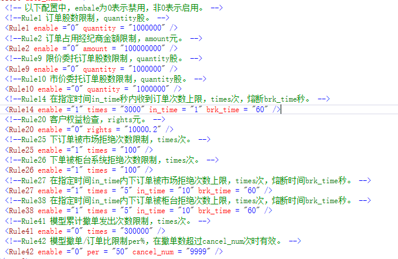

1. 问：有可能出现部成情况下多笔成交回报么？

    答：可能出现的。当报单qty数量>100，会按数量折半来处理成交回报，当剩下的数量又>100，会再次触发成交回报，直至剩余数量100。

2. 问：模拟撮合的策略是怎样的？

    答：按照轮循的方式，对所有报单进行未成交、部成、全成、拒单4种方式进行撮合，所以只要您下足够的报单，就能够触发所有的情况。

3. 问：模拟环境中的风控参数是怎样的？

    答：见下图

    

4. 问：模拟环境下的行情数据是几档价量？

    答：模拟环境下的行情数据目前是level1数据，所以只有5档行情。

5. 问：模拟环境下的行情数据多久刷新一次？
    
    答：模拟环境下目前采用抓取网页方式获取行情，目前设定的抓取频率是5s一次，所以可能跟实际的行情数据有时间差。

6. 问：出现拒单，拒单原因是217或者10000或者29999是怎么回事？

    答：这个是模拟撮合给出的交易所模拟拒单，方便调试您对拒单的处理，不代表报单错误。注：此时报单可能完全正确，在实盘环境下会正常报单。

7. 问：模拟测试环境是7*24小时的么？

    答：每日模拟环境会在每日早上重启，因此请在每日的9点-24点之间测试。

8. 问：触发风控，所有报单都被拒，怎么办？

    答：触发风控后需要重启服务器才能重置风控数据，因此请等待至第二天。由于风控只针对开仓单做限制，所以如果受限后，用户可以下平仓单进行测试。

9. 问：系统可以保留今日的股票数据么？

    答：已经可以保留今日的持仓数据了。

10. 问：模拟撮合后的成交价格是如何定的？

    答：限价单就是根据您的报价来撮合，如果是市价单，上交所是按1元来撮合，深交所按照涨跌停价之间的一个随机价格来撮合。

11. 问：模拟撮合在ETF申购上的撮合规则是怎样的？

    答：模拟撮合在ETF申购时，对于成分股，先扣今仓，今仓不够，扣昨仓；今仓+昨仓都不够时，使用现金替代；替代金额按照溢价比例计算。

12. 问：为何在公网测试环境订阅行情数据老是断线？

    答：由于公网测试环境测试用户较多，带宽有限，仅支持连通性测试。当订阅行情数量过多时，容易被服务器断线，因此请订阅几只股票行情数据来测试。
