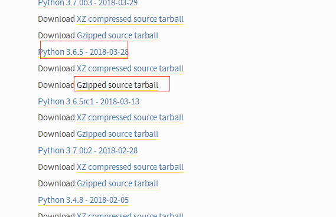
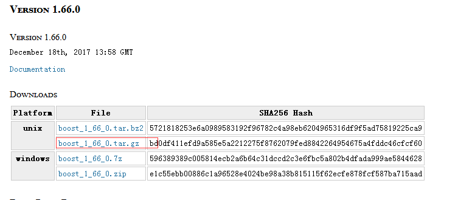
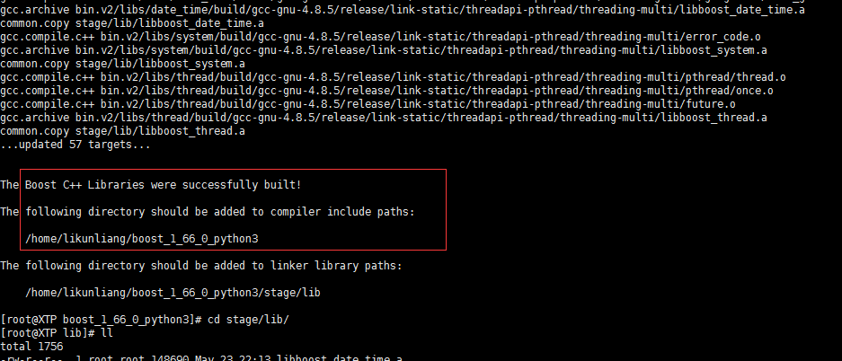
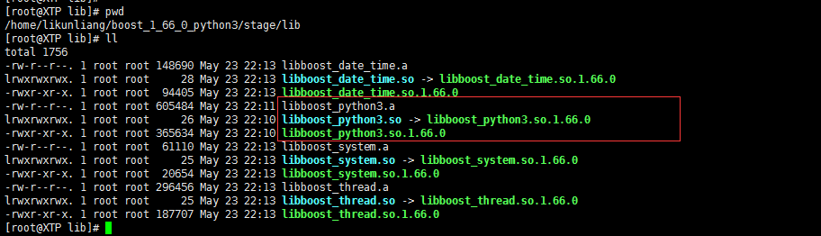

# Linux下boost.python3库编译说明

## 1. 环境准备

  1. **Linux**
  2. **python3.6.5(tar.gz)**
  3. **gcc (4.8.5版本)**
  4. **boost 1.66.0 (tar.gz)**

### 1 **[https://www.python.org/downloads/source/](https://www.python.org/downloads/source/)**下载**python3**，（可选其他版本）

   
   
  存放`/home/likunliang/`目录下(可选)，解压`tar -xvf Python-3.6.5.tar.gz`，`cd /home/likunliang/Python-3.6.5` 编译 `./configure --prefix=/usr/local/python3` 安装先`make` 然后再`make install` 。创建版本软连接，如有`python2`等其他版本，可先修改旧版本的软连接`mv /usr/bin/python /usr/bin/python_bak` ，创建新的软连接    
   `ln -s /usr/local/python3/bin/python3 /usr/bin/python`检查python的版本 `python -V`  显示：python-3.6.5软连接创建成功 。

### 进入官网[http://www.boost.org/](http://www.boost.org/)，选择最新的版本，这里是1.66.0版本
   
下载完成之后，解压

### boost的编译

a. 将 **boost_1_66_0.tar.gz** 解压至`/home/likunliang/`目录下，`cd /home/likunliang/boost_1_66_0`
b. `./bootstrap.sh --with-python=/usr/local/python3`
c. `./b2 --toolset=gcc-4.8.5  --with-python include="/usr/local/python3/include/python3.6m/" --with-thread --with-date_time  --with-chrono`

   （说明：`--with-python` 里面的python需要是python3版本，通过include参数指定自定义版本的python包含路径）
d. `./b2 --prefix=/usr/local/apps/boost install`, 之后会生成`/usr/local/apps/boost/include`和`/usr/local/apps/boost/lib`,里面的lib就是C++所需的python3的lib文件。至此boost.python3库编译完成。
e. 然后在`source/xtp_python3_2.2.30.7/CMakeLists.txt`中设置`find_package(Boost 1.79.0 COMPONENTS python310 thread date_time system chrono REQUIRED)`

